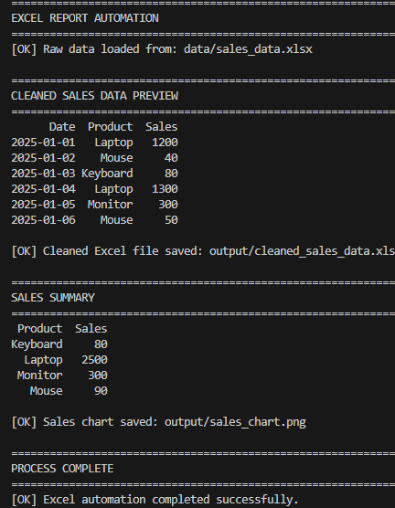
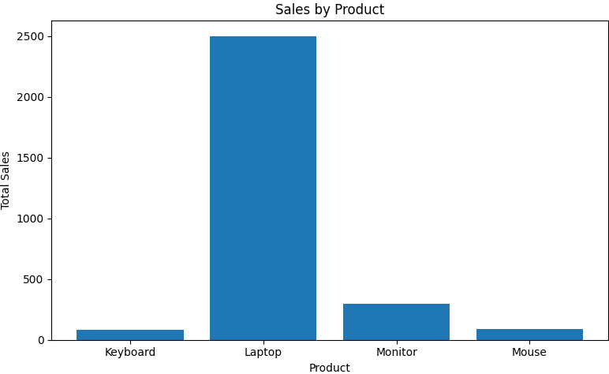
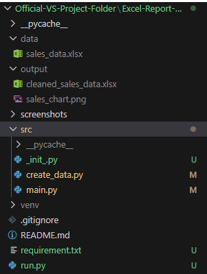

# Excel Report Automation

A Python automation tool that processes raw Excel sales data, cleans it using pandas, and generates summarized reports and charts automatically.

## Download

You can download the Windows executable from the **Releases** section.

Current release:
- **ExcelReportAutomation.exe**

## Demo

### Terminal Output

### Generated Sales Chart

### Project Structure

## Features

- Reads raw Excel sales data
- Cleans and processes the dataset
- Generates a summarized Excel report
- Creates a sales chart visualization

## Project Structure

Excel-Report-Automation/
│
├── src/
│   ├── main.py
│   └── create_data.py
│
├── data/
│   └── sales_data.xlsx
│
├── output/
│   ├── cleaned_sales_data.xlsx
│   └── sales_chart.png
│
├── requirements.txt
├── README.md
└── .gitignore

## Installation

Clone the repository:

git clone https://github.com/garvinedwards717-cloud/Excel-Report-Automation.git

Install dependencies:

pip install -r requirements.txt

## Usage

Generate example data:

python src/create_data.py

Run the automation script:

python src/main.py

## Output

The script generates:

- A cleaned Excel report
- A sales chart visualization
